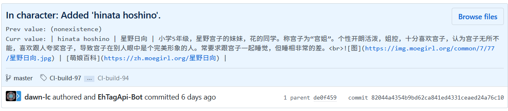

EhTagConnector
====
连接到 [EhTagTransation 数据库](https://github.com/ehtagtranslation/Database)的 RESTful API。

**[WIP] 本程序正在开发阶段，各 API 随时有可能更改！**

## API 使用

### API 域名

<https://ehtagconnector.azurewebsites.net/api/>

### 版本控制
使用 [`ETag`](https://developer.mozilla.org/zh-CN/docs/Web/HTTP/Headers/ETag) 进行版本控制，其值为最新一次 Git commit 的 sha1 值。可以使用[查询数据库数据版本](#查询数据库数据版本) API 进行查询。

+ `ETag` 将随 `HTTP 2XX` 及 `HTTP 404` 响应返回。

+ 对于 `GET` 请求，可以使用 [`If-None-Match`](https://developer.mozilla.org/zh-CN/docs/Web/HTTP/Headers/If-None-Match) 控制缓存。
  
+ 对于 `POST`, `PUT`, `DELETE` 请求，必须使用 [`If-Match`](https://developer.mozilla.org/zh-CN/docs/Web/HTTP/Headers/If-Match) 头以防止编辑冲突。  
  
  当未包含 `If-Match` 头时，将返回
  [`HTTP 428 Precondition Required`](https://developer.mozilla.org/zh-CN/docs/Web/HTTP/Status/428)；当
  `If-Match` 头的版本与最新版本不匹配时，将返回
  [`HTTP 412 Precondition Failed`](https://developer.mozilla.org/zh-CN/docs/Web/HTTP/Status/412)，此时需要使用对应的 `GET` 请求更新 `ETag` 及相应的资源。
  
> 参考：[HTTP 条件请求](https://developer.mozilla.org/zh-CN/docs/Web/HTTP/Conditional_requests)

### 用户认证

进行数据库修改（`POST`, `PUT`, `DELETE` 请求）时需要进行用户认证，需要的信息为用户的 GitHub token，可通过 [OAuth](https://developer.github.com/apps/building-oauth-apps/) 或 [PAT](https://github.com/settings/tokens) 获取，只用于确认用户信息，不需要除 public access 外的特殊 scope。

认证信息通过 `X-Token` HTTP 头输入（如 `X-Token: aaaaaaaaaaaaaaaaaaaaaaaaaaaaaaaaaaaaaaaa`）。

提交的显示效果如下：  


### 返回格式

使用 [`Accept`](https://developer.mozilla.org/zh-CN/docs/Web/HTTP/Headers/Accept) 头或 `format` 查询参数控制 API 返回 JSON 的格式，可选的值有：

- `Accept: application/json` / `?format=json`
  
  默认设置，返回所有信息。
  ```yaml
  {
    "name": {
      "raw": "轻音少女",
      "text": "轻音少女",
      "html": "<p>轻音少女</p>",
      "ast": [
        {
          "type": "paragraph",
          "content": [
            {
              "type": "text",
              "text": "轻音少女"
            }
          ]
        }
      ]
    },
    "intro": {
      "raw": "",
      "text": "",
      "html": "<p></p>",
      "ast": [
        {
          "type": "paragraph",
          "content": [
            {
              "type": "image",
              "title": "",
              "url": "https://ul.ehgt.org/ee/4f/ee4f3da314a2748030b53b9e495c8d20fd0d6fd5-1465878-5000-3501-jpg_l.jpg",
              "nsfw": false,
              "content": [
                {
                  "type": "text",
                  "text": "图"
                }
              ]
            }
          ]
        }
      ]
    },
    "links": {
      "raw": "",
      "text": "",
      "html": "",
      "ast": []
    }
  }
  ```
- `Accept: application/raw+json` / `?format=raw.json`
  
  仅返回 `raw` 字段内容。
  ```yaml
  {
    "name": "轻音少女",
    "intro": "",
    "links": ""
  }
  ```
- `Accept: application/html+json` / `?format=html.json`
  
  仅返回 `html` 字段内容。
  ```yaml
  {
    "name": "<p>轻音少女</p>",
    "intro": "<p></p>",
    "links": ""
  }
  ```
- `Accept: application/text+json` / `?format=text.json`
  
  仅返回 `text` 字段内容。
  ```yaml
  {
    "name": "轻音少女",
    "intro": "",
    "links": ""
  }
  ```
- `Accept: application/ast+json` / `?format=ast.json`
  
  仅返回 `ast` 字段内容。
  ```yaml
  {
    "name": [
      {
        "type": "paragraph",
        "content": [
          {
            "type": "text",
            "text": "轻音少女"
          }
        ]
      }
    ],
    "intro": [
      {
        "type": "paragraph",
        "content": [
          {
            "type": "image",
            "title": "",
            "url": "https://ul.ehgt.org/ee/4f/ee4f3da314a2748030b53b9e495c8d20fd0d6fd5-1465878-5000-3501-jpg_l.jpg",
            "nsfw": false,
            "content": [
              {
                "type": "text",
                "text": "图"
              }
            ]
          }
        ]
      }
    ],
    "links": []
  }
  ```

### 查询数据库基本情况

路径: `GET /database`

示例请求：
```yaml
GET /api/database
---
Accept: application/json
Accept-Encoding: gzip, deflate, br
If-None-Match: "5bd33aed633b18d5bca6b2d8c66dcf6b56bd75b1"
```

示例响应：
```yaml
HTTP/2.0 200 OK
---
Content-Type: application/json; charset=utf-8
Content-Encoding: br
ETag: "10ee33e7a348bf5842433944baa196da53eaa0df"
---
{
  # Git 地址
  "repo": "https://github.com/ehtagtranslation/Database.git",
  # 最新一次提交信息
  "head": {
    "author": {
      "name": "OpportunityLiu",
      "email": "Opportunity@live.in",
      "when": "2019-02-06T14:06:00+00:00"
    },
    "committer": {
      "name": "EhTagApi-Bot",
      "email": "47353891+EhTagApi-Bot@users.noreply.github.com",
      "when": "2019-02-06T14:06:00+00:00"
    },
    "sha": "10ee33e7a348bf5842433944baa196da53eaa0df",
    "message": "In parody: Added 'gotoubun no hanayome'.\n\nPrevious value: (non-existence)\nCurrent value: | gotoubun no hanayome | 五等分的新娘 | 《五等分的新娘》（日语：五等分の花嫁）是由日本漫画家春场葱所创作的少年漫画作品。于《周刊少年Magazine》2017年第36・37合并号开始正式连载中。 | [维基百科](https://zh.wikipedia.org/zh-cn/五等分的新娘) (\\*) |\n"
  },
  # 数据库结构版本
  "version": 5,
  # 数据库内容摘要
  "data": [
    {
      "namespace": "rows",
      "count": 9
    }
    # ...
  ]
}
```

### 查询数据库数据版本

如只需获取 `ETag` 信息（即最新一次提交的 sha1），可以使用 `HEAD` 请求。

路径: `HEAD /database`

示例请求：
```yaml
HEAD /api/database
---
If-None-Match: "5bd33aed633b18d5bca6b2d8c66dcf6b56bd75b1"
```

示例响应：
```yaml
HTTP/2.0 204 No Content
---
ETag: "10ee33e7a348bf5842433944baa196da53eaa0df"
```


### 查询某一分类的信息

路径: `GET /database/:namespace`

示例请求：
```yaml
GET /api/database/reclass
---
Accept: application/json
Accept-Encoding: gzip, deflate, br
```

示例响应：
```yaml
HTTP/2.0 200 OK
---
Content-Type: application/json; charset=utf-8
Content-Encoding: br
ETag: "d4553b638098466ef013567b319c034f8ee34950"
---
{
  "namespace": "reclass",
  "count": 11
}
```

### 查询某一条目是否存在

路径: `HEAD /database/:namespace/:raw`

示例请求：
```yaml
HEAD /api/database/reclass/private
---
```

示例响应：
```yaml
HTTP/2.0 204 No Content
---
ETag: "d4553b638098466ef013567b319c034f8ee34950"
```

> 条目不存在则返回 `HTTP 404 Not Found`。

### 查询某一条目的翻译

路径: `GET /database/:namespace/:raw`

示例请求：
```yaml
GET /api/database/male/shotacon
---
Accept: application/json
Accept-Encoding: gzip, deflate, br
```

示例响应：
```yaml
HTTP/2.0 200 OK
---
Content-Type: application/json; charset=utf-8
Content-Encoding: br
ETag: "d4553b638098466ef013567b319c034f8ee34950"
---
{
  "name": {
    "raw": "正太",
    "text": "正太",
    "html": "<p>正太</p>",
    "ast": [
      {
        "type": "paragraph",
        "content": [
          {
            "type": "text",
            "text": "正太"
          }
        ]
      }
    ]
  },
  "intro": {
    "raw": "小男孩。\n",
    "text": "小男孩。",
    "html": "<p>小男孩。<br />\n</p>",
    "ast": [
      {
        "type": "paragraph",
        "content": [
          {
            "type": "text",
            "text": "小男孩。"
          },
          {
            "type": "br"
          },
          {
            "type": "image",
            "title": "",
            "url": "https://exhentai.org/t/8d/e4/8de4084018d6fd26f7fb8843dfdba5949835ac02-219707-1128-1600-jpg_l.jpg",
            "nsfw": true,
            "content": [
              {
                "type": "text",
                "text": "举例"
              }
            ]
          },
          {
            "type": "image",
            "title": "",
            "url": "https://exhentai.org/t/b4/f2/b4f27457519a0eb55cbc231c34152084d8351cd3-543154-1000-1458-jpg_l.jpg",
            "nsfw": true,
            "content": [
              {
                "type": "text",
                "text": "图"
              }
            ]
          },
          {
            "type": "image",
            "title": "",
            "url": "https://exhentai.org/t/3a/46/3a466e7dc00e27d80e8d6be4674b08c6b8efb25f-304032-1067-1514-jpg_l.jpg",
            "nsfw": true,
            "content": [
              {
                "type": "text",
                "text": "图"
              }
            ]
          }
        ]
      }
    ]
  },
  "links": {
    "raw": "",
    "text": "",
    "html": "",
    "ast": []
  }
}
```

> 条目不存在则返回 `HTTP 404 Not Found`。

### 增加条目

路径: `POST /database/:namespace/:raw`

示例请求：
```yaml
POST /api/database/parody/gotoubun no hanayome
---
X-Token: aaaaaaaaaaaaaaaaaaaaaaaaaaaaaaaaaaaaaaaa
If-Match: "5bd33aed633b18d5bca6b2d8c66dcf6b56bd75b1"
Content-Type: application/json
---
{
    "name": "五等分的新娘",
    "intro": "《五等分的新娘》（日语：五等分の花嫁）是由日本漫画家春场葱所创作的少年漫画作品。于《周刊少年Magazine》2017年第36・37合并号开始正式连载中。 ",
    "links": "[维基百科](https://zh.wikipedia.org/zh-cn/五等分的新娘) (*)"
}
```

示例响应：
```yaml
HTTP/2.0 201 Created
---
Content-Type: application/json; charset=utf-8
Content-Encoding: gzip
Location: /api/database/parody/gotoubun no hanayome
ETag: "d4553b638098466ef013567b319c034f8ee34950"
---
{
  "name": {
    "raw": "五等分的新娘",
    "text": "五等分的新娘",
    "html": "<p>五等分的新娘</p>",
    "ast": [
      {
        "type": "paragraph",
        "content": [
          {
            "type": "text",
            "text": "五等分的新娘"
          }
        ]
      }
    ]
  },
  "intro": {
    "raw": "《五等分的新娘》（日语：五等分の花嫁）是由日本漫画家春场葱所创作的少年漫画作品。于《周刊少年Magazine》2017年第36・37合并号开始正式连载中。",
    "text": "《五等分的新娘》（日语：五等分の花嫁）是由日本漫画家春场葱所创作的少年漫画作品。于《周刊少年Magazine》2017年第36・37合并号开始正式连载中。",
    "html": "<p>《五等分的新娘》（日语：五等分の花嫁）是由日本漫画家春场葱所创作的少年漫画作品。于《周刊少年Magazine》2017年第36・37合并号开始正式连载中。</p>",
    "ast": [
      {
        "type": "paragraph",
        "content": [
          {
            "type": "text",
            "text": "《五等分的新娘》（日语：五等分の花嫁）是由日本漫画家春场葱所创作的少年漫画作品。于《周刊少年Magazine》2017年第36・37合并号开始正式连载中。"
          }
        ]
      }
    ]
  },
  "links": {
    "raw": "[维基百科](https://zh.wikipedia.org/zh-cn/五等分的新娘) (\\*)",
    "text": "维基百科 (*)",
    "html": "<p><a href=\"https://zh.wikipedia.org/zh-cn/五等分的新娘\" rel=\"nofollow\">维基百科</a> (*)</p>",
    "ast": [
      {
        "type": "paragraph",
        "content": [
          {
            "type": "link",
            "title": "",
            "url": "https://zh.wikipedia.org/zh-cn/五等分的新娘",
            "content": [
              {
                "type": "text",
                "text": "维基百科"
              }
            ]
          },
          {
            "type": "text",
            "text": " (*)"
          }
        ]
      }
    ]
  }
}
```

> 已有同名条目时将返回 `HTTP 422 Unprocessable Entity`，需改用 `PUT` 请求。

### 修改条目

路径: `PUT /database/:namespace/:raw`

示例请求：
```yaml
PUT /api/database/reclass/private
---
X-Token: aaaaaaaaaaaaaaaaaaaaaaaaaaaaaaaaaaaaaaaa
Content-Type: application/json
If-Match: "d4553b638098466ef013567b319c034f8ee34950"
---
{
  "name": "私人的",
  "intro": "私人画廊是一个非正式的类别，允许用户不与 E-Hentai 社区其他成员分享他们的内容。他们往往是想要成为自己的个人用户画廊，他们只是希望自己的朋友前来参观。",
  "links": ""
}
```

示例响应：
```yaml
HTTP/2.0 200 OK
---
Content-Type: application/json; charset=utf-8
Content-Encoding: gzip
ETag: "5bd33aed633b18d5bca6b2d8c66dcf6b56bd75b1"
---
{
  "name": {
    "raw": "私人的",
    "text": "私人的",
    "html": "<p>私人的</p>",
    "ast": [
      {
        "type": "paragraph",
        "content": [
          {
            "type": "text",
            "text": "私人的"
          }
        ]
      }
    ]
  },
  "intro": {
    "raw": "私人画廊是一个非正式的类别，允许用户不与 E-Hentai 社区其他成员分享他们的内容。他们往往是想要将其作为自己的个人用户画廊，或只是希望自己的朋友前来参观。从私人画廊获得的GP数量减少到上传者通常会收到的金额的10％。要创建私人图库，用户必须拥有铜星或更高星级。",
    "text": "私人画廊是一个非正式的类别，允许用户不与 E-Hentai 社区其他成员分享他们的内容。他们往往是想要将其作为自己的个人用户画廊，或只是希望自己的朋友前来参观。从私人画廊获得的GP数量减少到上传者通常会收到的金额的10％。要创建私人图库，用户必须拥有铜星或更高星级。",
    "html": "<p>私人画廊是一个非正式的类别，允许用户不与 E-Hentai 社区其他成员分享他们的内容。他们往往是想要将其作为自己的个人用户画廊，或只是希望自己的朋友前来参观。从私人画廊获得的GP数量减少到上传者通常会收到的金额的10％。要创建私人图库，用户必须拥有铜星或更高星级。</p>",
    "ast": [
      {
        "type": "paragraph",
        "content": [
          {
            "type": "text",
            "text": "私人画廊是一个非正式的类别，允许用户不与 E-Hentai 社区其他成员分享他们的内容。他们往往是想要将其作为自己的个人用户画廊，或只是希望自己的朋友前来参观。从私人画廊获得的GP数量减少到上传者通常会收到的金额的10％。要创建私人图库，用户必须拥有铜星或更高星级。"
          }
        ]
      }
    ]
  },
  "links": {
    "raw": "",
    "text": "",
    "html": "",
    "ast": []
  }
}
```

> 当请求内容与数据库内容一致时（未进行修改），将返回 `HTTP 204 No Content`。

> 条目不存在则返回 `HTTP 404 Not Found`，需改用 `POST` 请求。

### 删除条目

路径: `/database/:namespace/:raw`

示例请求：
```yaml
DELETE /api/database/reclass/private
---
X-Token: aaaaaaaaaaaaaaaaaaaaaaaaaaaaaaaaaaaaaaaa
If-Match: "3b24693f057ccb422ce76a3334be549c66139309"
```

示例响应：
```yaml
HTTP/2.0 204 No Content
---
ETag: "5bd33aed633b18d5bca6b2d8c66dcf6b56bd75b1"
```

> 条目不存在则返回 `HTTP 404 Not Found`。
